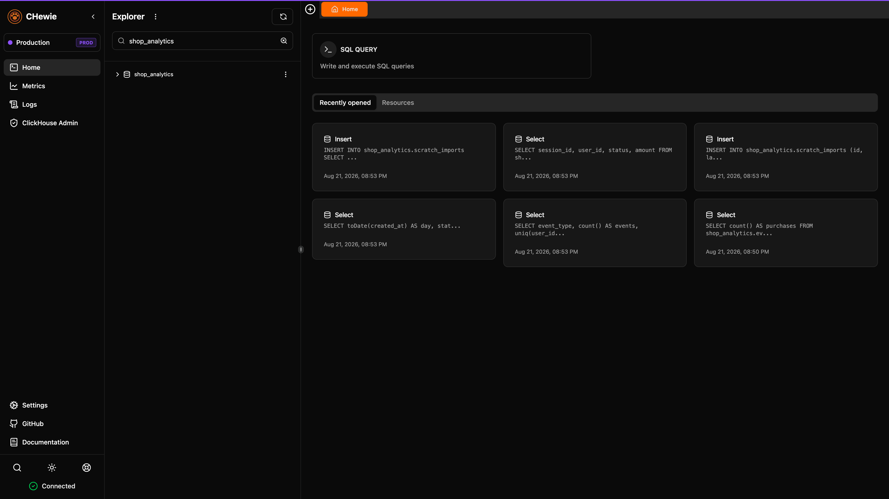
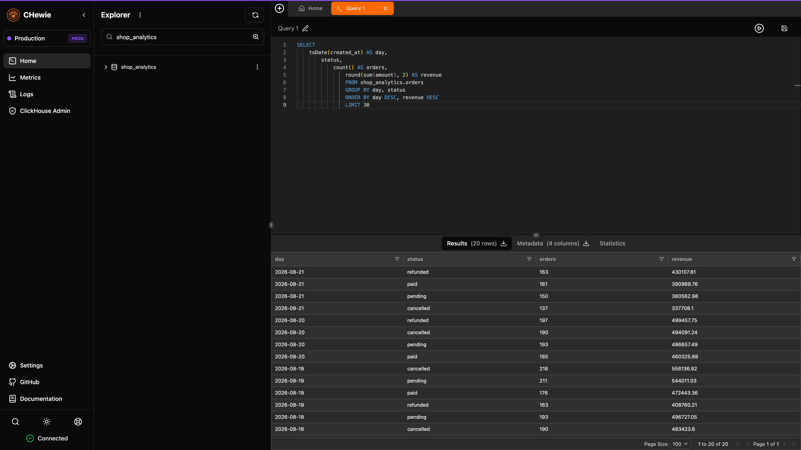
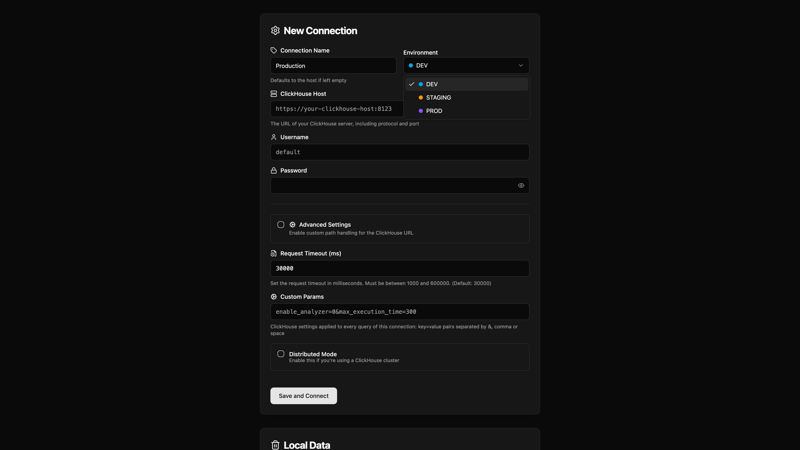
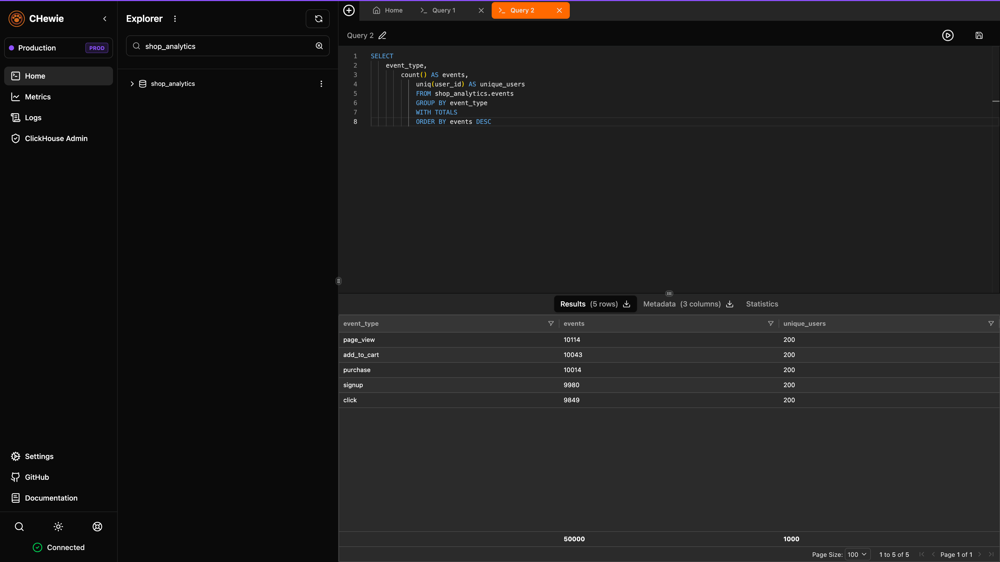
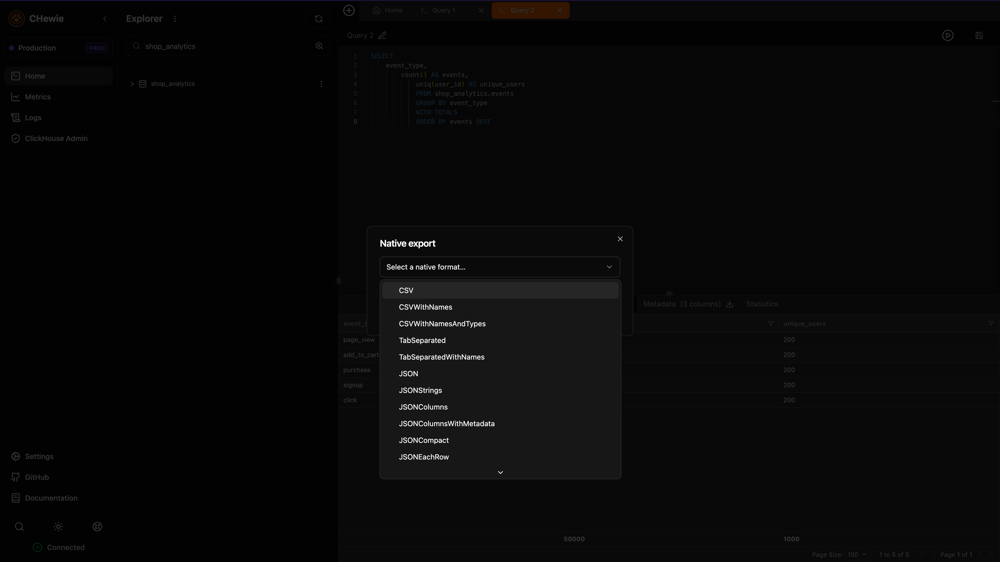
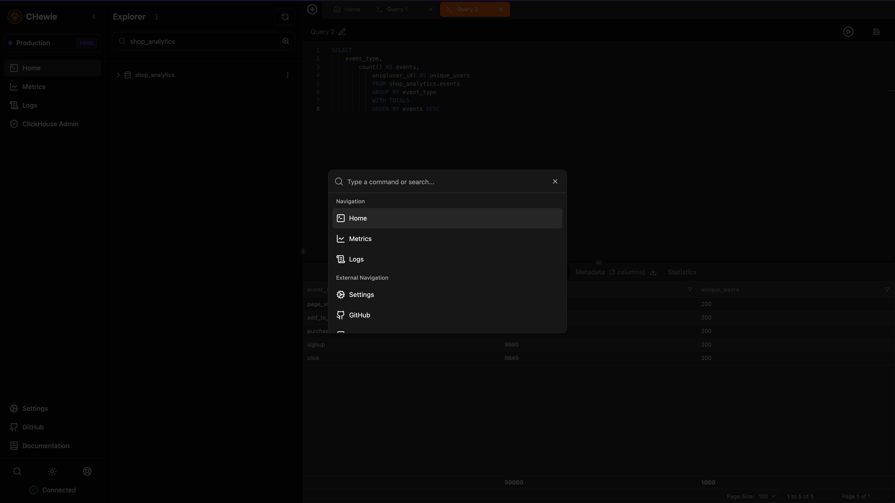
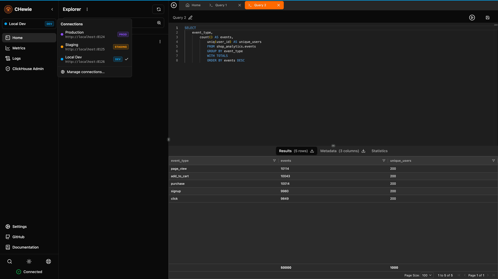
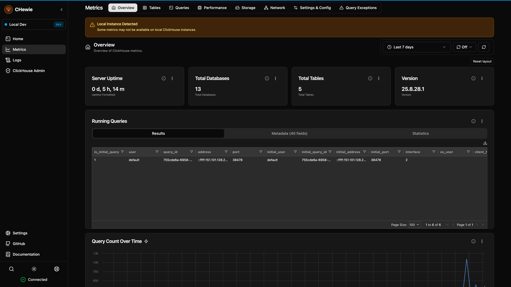
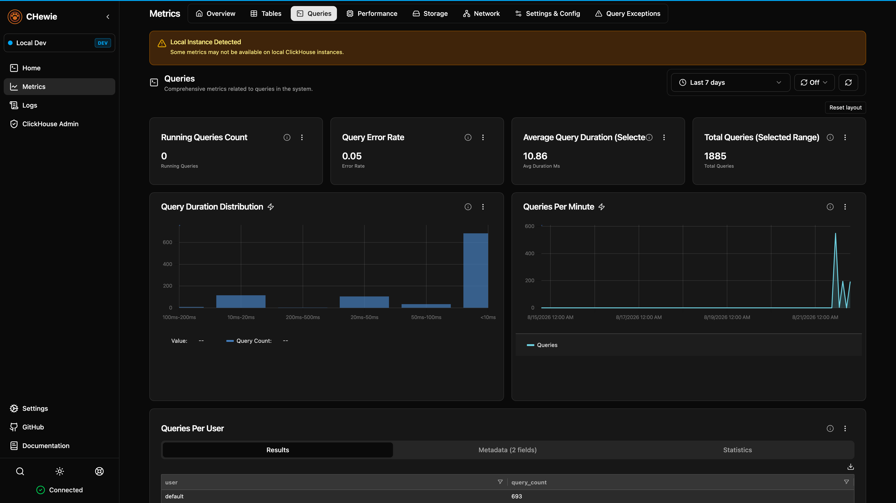
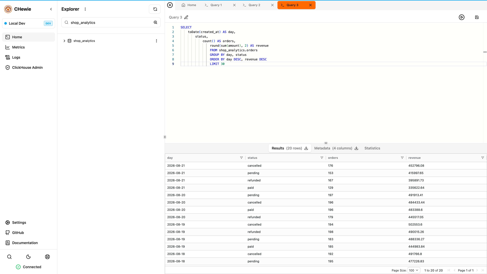

# CHewie Documentation

This directory documents the base functionality CHewie inherits from the original CH-UI project.

## Guides

- [Getting Started](getting-started.md) — installation via Docker, Docker Compose, or from source
- [Environment Variables](environment-variables.md) — full reference for all `VITE_*` config options
- [Reverse Proxy Setup](reverse-proxy.md) — deploying behind nginx, Apache, Traefik, Caddy, or HAProxy
- [Distributed ClickHouse](distributed-clickhouse.md) — `ON CLUSTER` operations and distributed tables
- [Permissions Guide](permissions.md) — ClickHouse grants required per feature
- [Troubleshooting](troubleshooting.md) — common issues and fixes

## Project

- [Contributing](contributing.md)
- [Acknowledgments](acknowledgments.md) — open-source projects this UI is built on
- [License](license.md) — Apache 2.0

## Screenshots

  
  
  
  
  
  
  
  
  
  

